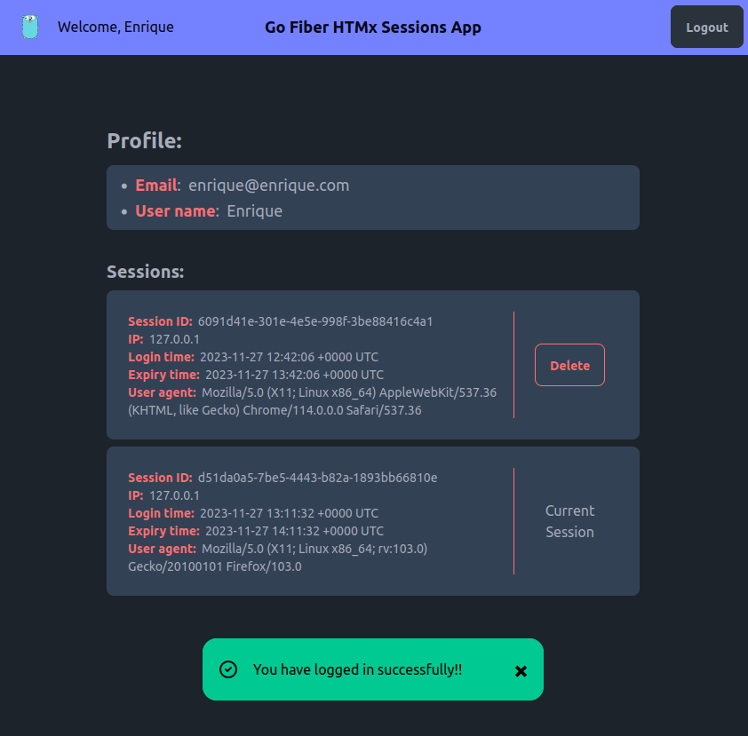
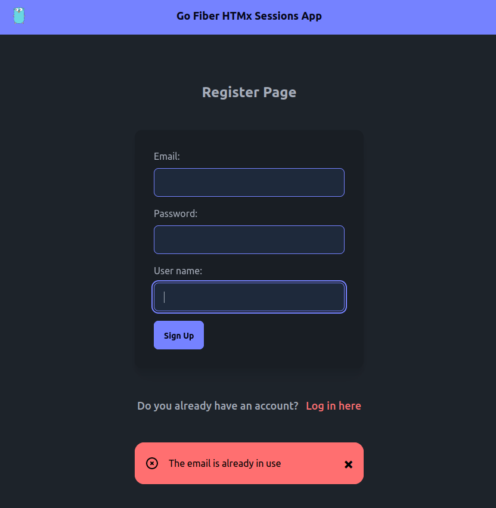

# Go Fiber HTMx Sessions App (Demo)

A full-stack application using Golang's Fiber framework with session-based authentication using Fiber's built-in [middleware](https://docs.gofiber.io/api/middleware/session). Requests to the backend are controlled by </> [htmx](https://htmx.org/) ([hypermedia](https://hypermedia.systems/) only).

## Sessions & SQLite3

A real-world example of how to use Fiber sessions with Storage package.\
Run localhost:3000 from multiple browsers to see active sessions for different users.

### Explanation

The Session middleware uses the [Storage](https://github.com/gofiber/storage/) package to support various databases through a single interface. The default configuration for this middleware saves data to memory.

In this example uses [SQLite3 Storage](https://github.com/gofiber/storage/tree/main/sqlite3) package to persist users sessions.\
Storage package can create sessions table for you at init time but for the purpose of this example I created it manually expanding its structure with an "u" column to better query all user-related sessions.

On the other hand, the styling of the views is achieved through Tailwind CSS and DaisyUI that are obtained from their respective CDNs.

Finally, minimal use of [_hyperscript](https://hyperscript.org/) is made to achieve the action of closing the alerts when they are displayed.

---

## Screenshots:

###### Profile Page with success alert:



<br>

###### Sign Up Page with error alert:



---

## Setup:

Besides the obvious prerequisite of having Go! on your machine, you must have Air installed for hot reloading when editing code.

Start the app in development mode:

```
$ air # Ctrl + C to stop the application
```

Build for production:

```
$ go build -ldflags="-s -w" -o ./bin/main . # ./bin/main to run the application
```

### Happy coding 😀!!